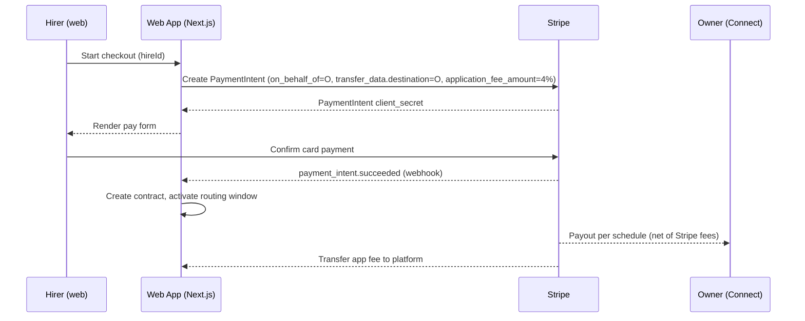
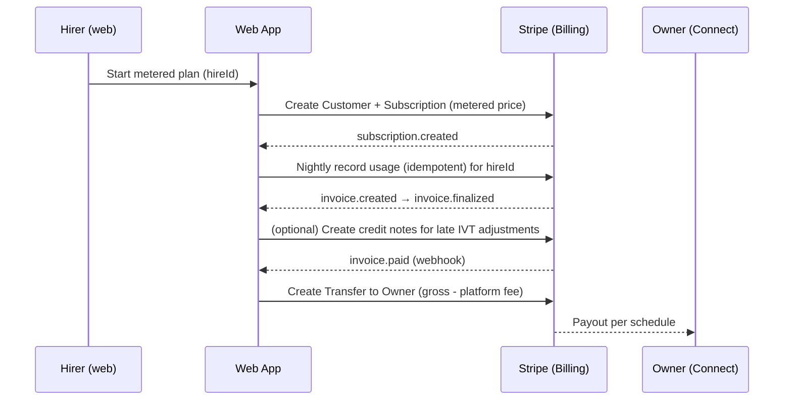

# Stripe Connect Flows

Overview
- Accounts: Stripe Connect Express for Owners; platform account for Hirer charges.
- Fees: Platform fee fixed at 4% of gross.
- Currencies: Start with USD; expand later.

Period Hires (Direct Charges)
- Use Direct Charges on Owner’s connected account; set `application_fee_amount=4%` to route platform fee to the platform.
- Owner pays Stripe processing fees; platform receives the application fee net of Stripe fees (no processing fee applied to the app fee itself).

Sequence — Period Checkout (Direct Charge)

Direct Charges — Implementation Notes
- Required fields: `transfer_data[destination]=acct_...`, `application_fee_amount` (4% of amount). Optionally `on_behalf_of=acct_...` for coherent fees and reporting.
- Idempotency: Include `Idempotency-Key` header using hireId + invoiceCycle + attempt to protect against retries.
- Webhooks: Handle `payment_intent.succeeded`, `payment_intent.payment_failed`, `charge.refunded`.
- Renewal: Create a new PaymentIntent each period (or use Subscriptions with fixed price on owner account; optional later).

Per‑Click Hires (Usage Billing)
- Use Stripe Billing subscription with a metered price on the platform account.
- Record usage from nightly rollups; transfer owner share post‑invoice via Connect Transfers (collect‑then‑transfer).

Sequence — Metered Plan + Collect then Transfer

Collect‑then‑Transfer — Implementation Notes
- Usage recording: see usage‑metering‑design.md for idempotency keys and retries.
- Transfers: After `invoice.paid`, compute owner share (gross usage charges × (1-0.04)); create one Transfer per Owner or per Hire.
- Fees: Platform pays Stripe processing fees on the collected charges; platform margin remains 4%.

Webhooks and Idempotency
- Verify signatures on all webhook endpoints.
- Handle retries and out‑of‑order delivery. Use idempotency storage keyed by event id and action hash.
- Required events
  - Direct Charges: `payment_intent.succeeded`, `payment_intent.payment_failed`, `charge.refunded`
  - Billing: `customer.subscription.created/updated/deleted`, `invoice.created/finalized/paid/payment_failed`, `charge.dispute.created/closed`

Error Handling & Retries
- Network/API errors: retry with exponential backoff; keep idempotency keys stable.
- On webhook processing failure: return non‑2xx to trigger Stripe retry; log and alert.
- For Transfers: if a transfer fails due to account state, queue and retry; notify Owner to complete KYC.

Disputes and Refunds
- Period (Direct Charges): issue refunds on the connected account; optionally refund application fee using `application_fee_refund` if granting full goodwill. For chargebacks, we may create a `transfer_reversal` of owner payouts if required.
- Metered: issue credit notes on finalized invoices for IVT adjustments; avoid refunds to preserve invoice integrity unless necessary. If refunding, reverse transfers accordingly.

Reconciliation
- Daily: compare AE rollups against Stripe invoice previews for usage plans.
- Monthly close: validate Transfers vs owner earnings; produce a payout report by Owner.

References
- Connect: Direct Charges, Collect then Transfer
- Billing: Usage‑based pricing and Record Usage

